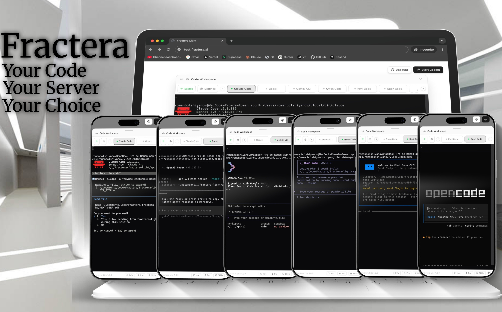

<h1 align="center">Fractera AI Workspace: Run Claude Code, Codex, Gemini CLI, Qwen Code, Kimi Code and Open Code in your browser — including on your phone. Built-in database and S3 storage.</h1>

  
  
  
  

  <strong>Anthropic:</strong> Claude Code &nbsp;·&nbsp;
  <strong>OpenAI:</strong> Codex &nbsp;·&nbsp;
  <strong>Google:</strong> Gemini CLI &nbsp;·&nbsp;
  <strong>Alibaba:</strong> Qwen Code &nbsp;·&nbsp;
  <strong>Moonshot:</strong> Kimi Code &nbsp;·&nbsp;
  <strong>OpenRouter:</strong> 300+ models

  

  
  &nbsp;&nbsp;
  

---

## Table of Contents
- [Why Fractera?](#why-fractera)
- [Core Features](#core-features)
- [Tech Stack](#tech-stack)
- [App Walkthrough](#app-walkthrough)
- [Free Skills](#free-skills-marketplace)
- [Roadmap](#roadmap)
- [FAQ](#faq)
- [Changelog](#changelog)

---

## Why Fractera?

Which AI model should you use for this task? Which platform should you run it on? What do you do when you run out of tokens? How do you write code from your phone? How do you stop depending on cloud databases and S3 storage? How do you stay in full control of your project — from the first line of code to publishing? How do you build faster and spend far fewer tokens?

These questions answer themselves once you try Fractera. You won't go back.

---

## Core Features

- **Parallel Interactive Terminals.** Run multiple AI sessions simultaneously. Switch between platforms without losing context.
- **Built-in Authentication.** Email/password auth, guest mode, and role-based access control. The first registered user becomes the Architect (Admin).
- **Absolute Data Portability.** Export and import your entire database and file storage in a single operation.
- **Integrated Database and Media Storage.** Built-in SQLite browser and local S3-compatible media library — store images, videos, and documents without external services.
- **Media Library.** Upload, crop, preview, and manage images and videos. Generate a full favicon and PWA icon set from a single source image.
- **Seamless Auto-Updates.** Pull the latest open-source version from upstream without SSH access to the server.
- **LightRAG — Unified Project Memory (v1.3).** Shared context and memory across all AI agents and sessions.
- **Open Claw — Business Orchestration (v1.4).** A single control point for your entire business — manage projects, agents, and workflows from one place.
- **Skills Marketplace (v1.5).** Extend your workspace with community-built AI skills at [fractera.ai](https://fractera.ai).

---

## App Walkthrough

Short video demonstrations:

**[Platform Activation](https://youtu.be/qH1BkwAXtEk)** — Launching Claude Code, Gemini, Codex, Qwen and Kimi in one terminal

**[Built-in Media Storage](https://youtu.be/p10t2lGz_y0)** — Upload, crop, rename and preview images without leaving the workspace

**[Database from S3 in One Prompt](https://youtu.be/nf-e3O-MBC0)** — Claude Code reads object storage, extracts structured data from images, and creates a populated database table — no SQL written

**[Employees Page from One Prompt](https://youtu.be/BKLk48bi0iQ)** — Full CRUD page with image upload, crop, and object storage wired together by the AI from a single plain-language instruction

---

## Tech Stack

- **Frontend:** Next.js 16.2, React 19, Tailwind v4, shadcn/ui
- **Backend:** Next.js API routes, Node.js bridge server (WebSocket), Express media service
- **Database:** SQLite via better-sqlite3 — no external database required
- **Authentication:** NextAuth v5 — email/password, guest mode, role-based access (architect / user / guest)
- **Object Storage:** Local filesystem (`storage/`) — no cloud storage subscriptions
- **Media Service:** Standalone HTTP service on port 3300 — upload, crop, favicon generation, PWA icons
- **Architecture:** Parallel Slot Architecture with built-in error isolation

---

## Free Skills Marketplace

Earn up to 8 free skills from the Fractera marketplace. Send proof to `admin@fractera.ai`:

- Fork this repository `(+1 skill)`
- Star this repository `(+1 skill)`
- Leave a review on fractera.ai `(+1 skill)`
- Post on X (Twitter) with a link `(+1 skill)`
- Write an article on Medium `(+2 skills)`
- Write on dev.to or any dev blog `(+2 skills)`

---

## Roadmap

- [x] **v1.2** — Media Library, Database Browser, PWA icons, full agent documentation. *(Current)*
- [ ] **v1.3** — LightRAG: unified memory across all agents and sessions.
- [ ] **v1.4** — Open Claw: single control point for your entire business — projects, agents, workflows.
- [ ] **v1.5** — Skills Marketplace: community-built AI skills at fractera.ai.

All updates are free for self-hosted users. For enterprise features including multilingual routing, see [Fractera Pro](https://github.com/Fractera/fractera).

---

## Custom Development and Support

Fractera AI Workspace is open-source. The team is also available for custom engagements — bespoke AI applications, multilingual routing, parallel slot architecture, or proprietary builds on top of Fractera.

**Contact:**
- Email: [admin@fractera.ai](mailto:admin@fractera.ai)
- CEO: Julia Kovalchuk
- CTO: Roma Bolshiyanov (Armstrong)

---

## FAQ

**Can Fractera run on a low-end mobile phone?**

Yes. The phone only renders terminal output — all computation runs on your server. Any browser-capable device works as a client.

**Can I connect a cloud database, S3, or other external services?**

There are no restrictions. Connect external services through environment variables the same way you normally would. Variables can be set directly in production via **Settings → Configure** inside the app without server access. The built-in SQLite database and local file storage are defaults that protect against unexpected cloud costs — the choice remains yours.

---

  
  &nbsp;&nbsp;
  

---

## Changelog

---

**v1.2.2** — 2026-04-27

- Added reusable upload service (`services/upload/`) with built-in image crop support
- Added CLAUDE.md instructions for AI agents to use the upload service directly — enables any AI model to build object-storage features from a plain-language prompt with no custom upload code

---

**v1.2.1** — 2026-04-27 13:00

- Crop format selector (16:9 / 1:1 / 9:16) moved inside the cropper — works correctly on mode switch
- CLAUDE.md updated with full database and media storage API instructions for AI agents

---

**v1.2.0** — 2026-04-26 23:59

Database Browser — inline SQLite table viewer and editor built into the workspace.

- New "Database" button in the Settings menu opens a full-panel database browser
- Left sidebar (250px, sticky) lists all application tables: users, sessions, accounts, verification_tokens
- Right area shows all columns and rows with horizontal scroll support
- Hover any row to reveal: pencil icon per cell, delete button at far right
- Pencil opens an edit modal with context-aware input type:
  - `roles` column — multi-checkbox selector (architect / user / guest), stored as JSON array
  - `is_active` — single select (1 / 0)
  - `provider` — single select (credentials / google / github / guest)
  - `locale` — single select (en / ru / es / fr / de / zh)
  - All other columns — free textarea
- Delete row with confirmation overlay (one row at a time)
- All edits and deletes show toast feedback
- API routes secured: table names validated against sqlite_master, column names validated against PRAGMA table_info — no SQL injection possible
- Media database (services/media/data/media.db) is intentionally separate and not shown here

---

**v1.1.0** — 2026-04-26 23:00

Media Library — standalone media service and full asset management system.

- New standalone HTTP service `services/media/` running on port 3300, isolated from the main Next.js app
- SQLite database for media metadata: title, description, original filename, MIME type, dimensions, duration, storage key
- Image upload with built-in canvas-based cropper — three aspect ratio modes: 16:9 horizontal, 1:1 square, 9:16 vertical
- Video upload with direct storage (no crop)
- Media library panel in workspace Settings menu — list view with search, preview, copy URL, rename, delete
- Search across title, description, original filename and file URL with relevance-based sorting
- Inline preview popup for images and videos directly in the panel
- Per-file edit panel (pencil icon) for setting custom title and description independently from original filename
- Delete confirmation flow to prevent accidental removal
- Copy URL button with clipboard toast feedback
- Favicon and PWA icon generation from a single square source image: favicon.ico (16+32px combined), favicon-16/32.png, apple-touch-icon.png (180×180), icon-192/512.png, og-image.jpg (1200×630), manifest.json
- Project is PWA-ready at the icon level — manifest and all required icon sizes generated automatically
- CLAUDE.md and AGENTS.md updated with full media service API documentation for AI agents
- All three services (app, bridge, media) start together via single `npm run dev` from repo root

---

**v1.0.0** — 2026-04-26 20:00

Initial public release of Fractera AI Workspace — a self-hosted, open-source platform for running multiple AI coding agents in a single unified workspace.

- Multi-platform terminal workspace: Claude Code, Codex, Gemini CLI, Qwen Code, Kimi Code, Open Code (OpenRouter)
- Parallel interactive terminal sessions — switch between agents without losing context
- Single bridge server process manages all platform WebSocket connections on ports 3200–3206
- Built-in authentication: email/password registration, guest mode, architect role (first registered user)
- Role-based access control — architect gets coding workspace, users get standard access
- Data export/import — full backup and restore of SQLite database and storage files as a single zip
- Safe import merge — incoming data is merged with existing records, nothing is overwritten
- Auto-update from upstream GitHub repository via UI button, no SSH required
- Settings panel with environment variable editor — configure API keys, title, theme without touching files
- Info panel with live README rendering from GitHub or local file
- Proxy-based route protection (Next.js 16 native, no middleware.ts)
- Dark/light/system theme switcher with persistent preference
- Full shadcn/ui component library integrated
- Toast notifications wired globally via root layout

---

  Built for developers who value independence.

